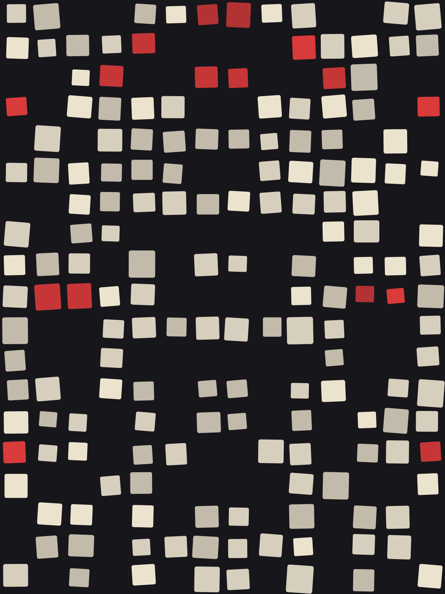

# poster-bg-skill

Seeded SVG backgrounds in the spirit of the Polish School of Posters, 60s/70s geometric modernism and Wojciech Fangor's soft op art. One dependency-free generator (`poster-bg/scripts/gen.js`), a [Claude Code](https://claude.com/claude-code) skill that drives it, and a standalone dark generator page.

**[Open the generator](https://dawidw.github.io/poster-bg-skill/generator/)**

The same motif, palette and seed always give the same image, so any result can be reproduced or varied by changing only the seed.

| | | |
|---|---|---|
|  |  |  |
| `dream` · `dream_navy` | `dream` · `dream_sun` | `ring` · `soft_orchid` |
|  |  |  |
| `ring` · `soft_flame` | `fangor` · `fangor_blue` | `mosaic` · `roger` |

## Use it from the command line

Needs Node, nothing else.

```bash
node poster-bg/scripts/gen.js --dream --out waves.svg
node poster-bg/scripts/gen.js --ring --colors random --circle 1.2 --x 0.4 --y 0.6 --out ring.svg
node poster-bg/scripts/gen.js --motif mosaic --palette roger --grain 18 --out mosaic.svg
node poster-bg/scripts/gen.js --poster --seed 12 --size 1440x900 --out poster.svg
```

It prints `motif=… palette=… seed=… size=…` to stderr, which is the recipe for reproducing the image.

| Flag | Meaning |
|---|---|
| `--poster` | random Polish-School motif: `stripes`, `rings`, `mosaic`, `blob`, `diagonals`, `steps` |
| `--fangor` | Fangor's vibrating concentric discs |
| `--ring` | one simple soft ring, 3 to 5 inks |
| `--dream` | flowing wavy bands with soft edges |
| `--motif m`, `--palette p` | pin a motif and/or a palette |
| `--colors random` | harmonious random colors (seeded) |
| `--seed N`, `--size WxH` | seed and size (default 1200x1600) |
| `--circle N`, `--x N`, `--y N` | size (0.5 to 1.5) and centre (0 to 1) for `ring`, `fangor`, `dream` |
| `--grain N` | mosaic tiles across the width (5 to 30) |

Run the script with an unknown palette name to list all motifs and palettes.

## Use it as a Claude Code skill

Copy the skill folder into your skills directory:

```bash
cp -R poster-bg ~/.claude/skills/
```

Then in Claude Code: `/poster-bg --dream`, or just ask for "three blue Fangor rings". The skill reports the recipe line so you can reproduce a result, and can place the SVG into a Figma file (it pastes `gen.js` into `use_figma` and calls `figma.createNodeFromSvg`).

## Generator page

`generator/index.html` is a standalone dark UI: family and style switches, palette with editable and removable colors, random colors, seed, size presets, circle size and position (sliders or drag on the preview), mosaic granularity, history, SVG and PNG export, and a button that copies the matching CLI command.

It loads `gen.js` with a relative path, so serve the repository root, for example:

```bash
python3 -m http.server
# then open http://localhost:8000/generator/
```

Live: <https://dawidw.github.io/poster-bg-skill/generator/>

## How it works

Every motif is a function `(r, palette, w, h, options) → { defs, body }` built from plain SVG shapes and gradients, driven by a seeded random generator. There are no filters: even the soft edges of `dream` come from stacks of translucent strokes, so the output imports into design tools as ordinary vectors.

New palettes are one entry in `PALETTES`; new motifs are one function registered in `MOTIFS` (see the skill's "Extending" section).

## Credits

Inspired by the Polish School of Posters and by the paintings of Wojciech Fangor. These are styles and techniques, not copies of any particular work.

MIT licensed.
